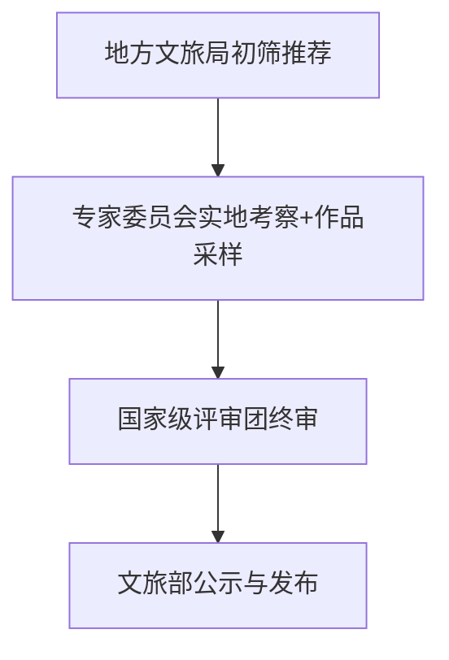

> **定位**：由国家文化和旅游部主导、权威学术机构支持、媒体协同传播的国家级非遗匠人评价体系  
> **使命**：系统性发掘、认证与推广中国传统冷兵器领域的杰出传承人，推动武备文化活态传承与国际传播

---

## 一、榜单名称

- **主名称**：《中国冷兵器匠人影响力排行榜》  
- **副标题**：*“铸剑为铭 · 匠心载道”*  
- **英文名**：*China Cold Weapon Artisans Power List*  
- **年度标识**：2025年度（首届）

---

## 二、组织架构（突出政府主导、多方协同）

| 角色 | 机构/单位 | 职责 |
|------|----------|------|
| **主办单位** | **中华人民共和国文化和旅游部** （非物质文化遗产司） | 政策指导、资源统筹、公信力背书 |
| **承办单位** | 中国非物质文化遗产保护中心 中国工艺美术学会 | 组织实施、标准制定、评审协调 |
| **学术支持** | 故宫博物院器物部 国家博物馆兵器研究中心 中国社会科学院历史研究院 相关高校（如北师大、浙大非遗研究基地） | 提供历史依据、技艺鉴定、学术审核 |
| **媒体合作方** | **胡润百富（作为媒体与数据合作方）** 央视综合频道 / 央视频 Bilibili纪录片频道 抖音文化垂类 | 数据采集、榜单包装、全媒体传播、公众互动 |
| **技术支持** | 国家级材料实验室（如钢铁研究总院） 数字文保技术团队 | 刀剑性能检测、3D数字化建档 |

> ✅ **调整说明**：  
> 胡润不再作为榜单发起方或品牌主体，而是以**专业媒体与数据服务机构**身份参与，负责：
> - 公众影响力数据采集（社交媒体声量、搜索指数等）
> - 榜单视觉设计与国际化传播
> - 协助对接高端消费与收藏圈层资源

---

## 三、评选维度（权重分配）

采用“**传承为本、创新为用、影响为桥**”原则，总分100分：

| 维度 | 权重 | 说明 | 数据来源 |
|------|------|------|--------|
| **1. 技艺传承深度** | 35% | - 是否掌握国家级/省级非遗技艺 - 师承谱系清晰度 - 对古法（如百炼钢、夹钢、包钢）的掌握程度 | 非遗档案、专家实地考察、口述史记录 |
| **2. 历史复原准确性** | 20% | - 作品是否严格依据《武经总要》《天工开物》等典籍 - 形制、纹饰、铭文、装配符合历史时期特征 | 学术专家盲评、博物馆比对 |
| **3. 文化传播与教育贡献** | 20% | - 开展公众体验活动次数 - 出版著作/教学视频 - 媒体报道数量与质量（含央视、纪录片） | 活动记录、出版物、文旅部舆情监测 |
| **4. 当代创新与应用** | 15% | - 与文创、影视、游戏、展览等跨界合作 - 设计符合现代审美但不失传统精神 | 合作案例、专利、展览证明 |
| **5. 社会认可与合规性** | 10% | - 获得官方非遗传承人认证级别 - 作品合法备案（非管制刀具） - 无知识产权争议 | 官方证书、公安备案记录 |

---

## 四、参评资格

- **基本条件**：
  - 为中国大陆户籍或长期在华从事冷兵器制作的匠人
  - 从事刀、剑、枪、戟、弓、甲胄等传统冷兵器手工制作 ≥ 5年
  - 拥有至少1项公开可验证的代表性作品（实物、影像或收藏记录）
- **优先条件**：
  - 国家级/省级非遗代表性传承人
  - 有明确师承谱系且持续带徒
  - 作品被博物馆、文化机构收藏
- **排除情形**：
  - 纯机械化量产仿制品制造商
  - 未依法备案的管制刀具制作者
  - 存在文化挪用或历史虚无主义倾向者

---

## 五、榜单结构（年度发布）

### 1. **主榜：年度十大冷兵器匠人**
- 综合得分前10名
- 由文旅部颁发 **“国家级冷兵器文化传承推广大使”** 荣誉证书
- 作品纳入 **“中国传统武备数字博物馆”**

### 2. **专项荣誉（非排名，仅表彰）**
| 荣誉名称 | 授予对象 |
|--------|--------|
| **历史复原典范奖** | 对唐横刀、汉环首刀、宋手刀等复原最精准者 |
| **青年传承先锋（U40）** | 40岁以下，兼具传统功底与传播能力 |
| **女性匠艺之光** | 在男性主导领域取得突破的女性匠人 |
| **国际文化交流贡献奖** | 推动中日、中韩、中欧兵器文化对话者 |

> 📌 注：**不设商业性“排名炒作”**，强调“表彰+推广”而非“竞争”

---

## 六、评审机制

### 1. **三级评审流程**

### 2. **评审团构成（文旅部聘任）**
| 类别 | 代表 | 比例 |
|------|------|------|
| 非遗保护专家 | 国家非遗评审委员、高校学者 | 40% |
| 文博机构研究员 | 故宫、国博、军博兵器专家 | 30% |
| 行业传承大师 | 国家级非遗传承人（非参评者） | 20% |
| 公众代表 | 媒体人、文化KOL、观众代表（通过文旅部官网征集） | 10% |

---

## 七、发布与传播

### 1. **官方发布**
- 时间：每年“文化和自然遗产日”（6月第二个周六）
- 形式：
  - 文旅部官网公告
  - 《中国非遗年度报告》专章收录
  - 央视《非遗里的中国》特别节目联动播出

### 2. **媒体协同（胡润角色）**
- 胡润百富负责：
  - 制作榜单可视化报告（中英双语）
  - 在其平台发布《冷兵器匠人影响力白皮书》
  - 协助对接高端收藏家、奢侈品圈层、国际媒体

### 3. **公众参与**
- 抖音/B站发起 `#寻找身边的铸剑人#` 话题
- 开放“匠人工坊”预约参观（纳入文旅研学线路）

---

## 八、后续赋能机制

- **纳入国家非遗传承人培养体系**：优先推荐申报更高层级非遗认定
- **对接文旅产业**：作品进入“非遗好物”电商平台、景区文创店
- **国际推广**：推荐参与“欢乐春节”“中国文化年”海外展览
- **数字存档**：3D扫描作品，接入“国家文化大数据体系”

---

## 九、风险防控

- **政治安全**：强调“止戈为武”“剑以载道”的和平文化内涵，避免 glorify violence（美化暴力）
- **法律合规**：所有作品须通过公安部门“非管制刀具”备案
- **学术严谨**：禁止虚构历史、夸大技艺，设立学术伦理审查小组

---

> **结语**：  
> 此榜单不是商业排行榜，而是**国家主导的文化抢救与价值重估工程**。  
> 通过文旅部权威引领、学术机构严谨把关、媒体平台有效传播，  
> 让那些在深巷中默默锻打千年钢火的匠人，  
> 成为新时代中华优秀传统文化的“国家代言人”。